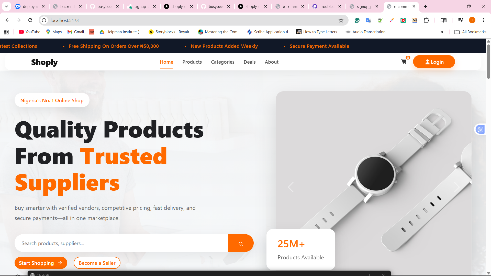
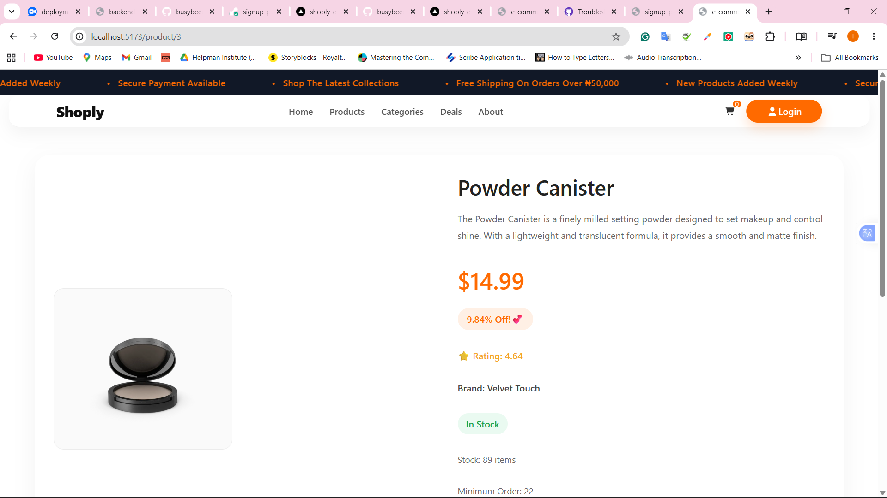
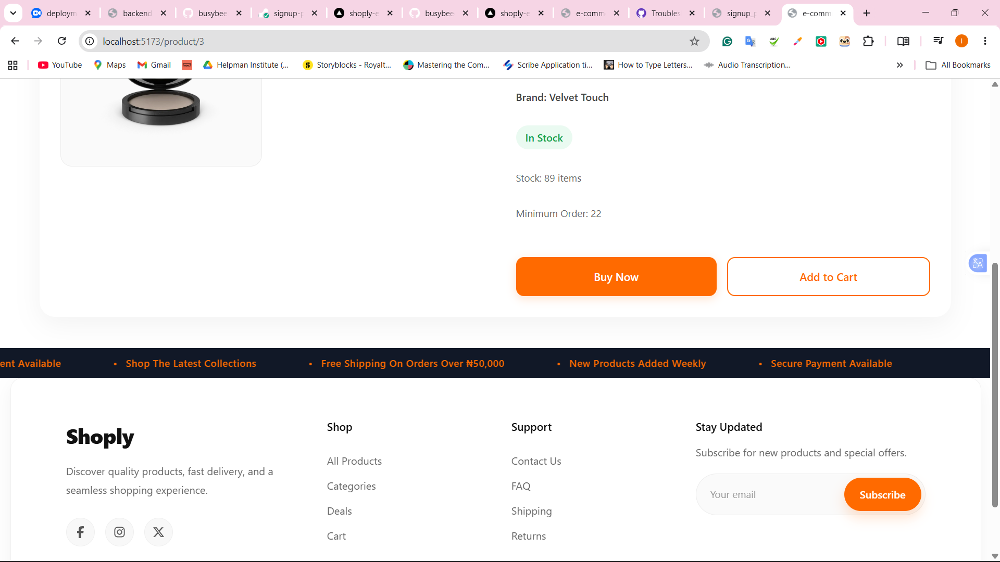

# 🛍️ Shoply E-Commerce

A modern e-commerce frontend application built with **React** and **Vite**. Shoply provides users with a clean and responsive shopping experience where they can browse products, search for items, and view detailed product information. Product data is dynamically fetched from the **DummyJSON REST API**.

---

## 🌐 Live Demo

👉 https://shoply-ecommerce-6dypvo3fr-busybeedev2.vercel.app/

---

## 📸 Screenshots

### Homepage



### Product Details





---

# ✨ Features

- Browse all available products
- View detailed information for individual products
- Search products by keyword
- Browse product categories
- Fetch product data dynamically from the DummyJSON REST API
- Display product information in a clean and responsive interface
- Support asynchronous API requests using the Fetch API
- Responsive design for desktop, tablet, and mobile devices

---

# 🛠️ Technologies Used

## Frontend

- React
- Vite
- JavaScript (ES6+)
- HTML5
- CSS3
- React Router DOM

## Libraries & Packages

- React
- React DOM
- React Router DOM
- React Bootstrap
- Bootstrap
- Font Awesome
  - `@fortawesome/react-fontawesome`
  - `@fortawesome/free-solid-svg-icons`

---

# 📁 Project Structure

```text
shoply_ecommerce/
│
├── public/
│
├── src/
│   ├── assets/
│   ├── components/
│   ├── pages/
│   ├── screenshots/
│   ├── App.css
│   ├── App.jsx
│   ├── index.css
│   ├── main.jsx
│   └── servicesapi.js
│
├── node_modules/
├── package.json
├── package-lock.json
├── vite.config.js
├── eslint.config.js
├── .gitignore
└── README.md
```

---

## 📂 Folder Description

| Folder/File | Description |
|-------------|-------------|
| **public/** | Contains static assets served directly by the application. |
| **src/** | Contains the application's source code. |
| **assets/** | Stores images, icons, and other project assets. |
| **components/** | Contains reusable React components such as the Navbar, Footer, ProductCard, HeroSection, SearchBar, CartItem, and ScrollingBanner. |
| **pages/** | Contains application pages including Home, Product Details, Search, Cart, and Checkout. |
| **screenshots/** | Stores screenshots used in the project documentation. |
| **servicesapi.js** | Handles API requests to the DummyJSON REST API. |
| **App.jsx** | Root React component and application routing. |
| **main.jsx** | Entry point of the React application. |
| **App.css** | Styles specific to the App component. |
| **index.css** | Global application styles. |
| **package.json** | Stores project metadata, dependencies, and npm scripts. |
| **package-lock.json** | Locks dependency versions for consistent installations. |
| **vite.config.js** | Configuration file for Vite. |
| **eslint.config.js** | ESLint configuration file. |
| **.gitignore** | Specifies files ignored by Git. |
| **README.md** | Project documentation. |

---

# 🔌 API Integration

Shoply consumes product data from the **DummyJSON REST API** through a dedicated service layer.

```javascript
const BASE_URL = "https://dummyjson.com";

export async function getProducts() {
    const response = await fetch(`${BASE_URL}/products`);
    return response.json();
}

export async function getProduct(id) {
    const response = await fetch(`${BASE_URL}/products/${id}`);
    return response.json();
}

export async function searchProducts(query) {
    const response = await fetch(
        `${BASE_URL}/products/search?q=${query}`
    );
    return response.json();
}

export async function getCategories() {
    const response = await fetch(
        `${BASE_URL}/products/categories`
    );
    return response.json();
}
```

---

# 🚀 Installation

### 1. Clone the repository

```bash
git clone https://github.com/busybeedev1/shoply_ecommerce.git
```

### 2. Navigate into the project

```bash
cd shoply_ecommerce
```

### 3. Install dependencies

```bash
npm install
```

### 4. Start the development server

```bash
npm run dev
```

The application will be available at:

```
http://localhost:5173
```

---

# 📦 Deployment

The application is deployed on **Vercel**.

**Live URL:**

https://shoply-ecommerce-6dypvo3fr-busybeedev2.vercel.app/

---

# 👨‍💻 Author

**Ebesu Ifiok-Obong Victor**

- GitHub: https://github.com/busybeedev1
- Email: ebesuvictor@gmail.com

---

## ⭐ Acknowledgements

- DummyJSON API for providing sample product data.
- React and Vite for enabling a fast and modern frontend development experience.
- React Bootstrap and Font Awesome for UI components and icons.